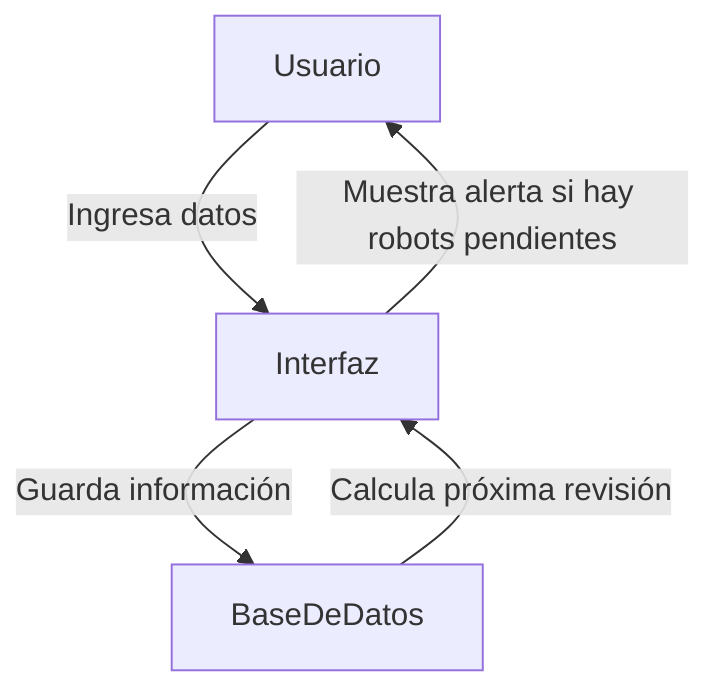
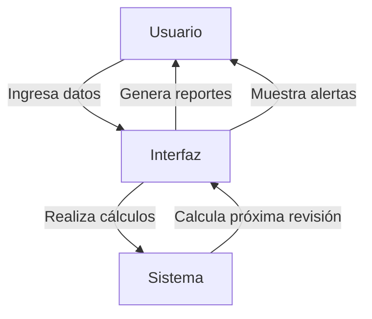

[IR A PROYECTO 3](#proyecto-3-un-código-abierto-para-la-transformación-digital)

# (PARTES 1 Y 2) PROPUESTA INICIAL: Sistema de Gestión de Mantenimiento para Brazos Robóticos

## Descripción del Proyecto

Este proyecto consiste en el desarrollo de un **software de gestión de mantenimiento** para brazos robóticos en un entorno industrial. La solución permitirá **registrar, gestionar y notificar** las revisiones de mantenimiento, asegurando que los robots operen de manera eficiente y evitando fallos inesperados. 

### Características principales:
✅ **Registro de robots** con información detallada (modelo, fecha de última revisión, próxima revisión).  
✅ **Cálculo automático** de la fecha de la próxima revisión.  
✅ **Generación de reportes** de robots que necesitan mantenimiento.  
✅ **Alertas visuales** si un robot está fuera de su período de revisión.  

## Ciclo de Vida del Dato

Los datos en este proyecto siguen el siguiente flujo:
1. **Generación:** Se ingresan los datos manualmente desde la interfaz gráfica.
2. **Almacenamiento:** Se guardan en una base de datos **SQLite**.
3. **Consulta y Actualización:** El sistema consulta los datos para mostrar reportes y actualizar fechas de revisión.
4. **Eliminación:** Se pueden eliminar registros de robots que ya no están en uso.

### Estrategia para garantizar la consistencia e integridad:
- Uso de **claves primarias** en la base de datos.
- Restricciones de **formato en las fechas** para evitar errores.
- Validaciones en la interfaz para evitar datos inconsistentes.

## Almacenamiento en la Nube

Actualmente, el software utiliza **SQLite** como base de datos local. Sin embargo, en futuras versiones se podría integrar:
- **Google Firebase** o **AWS DynamoDB** para almacenamiento en la nube.
- **Encriptación** de datos para seguridad.
- **Backups automáticos** para garantizar disponibilidad.

## Seguridad y Regulación

Aunque la base de datos es local, en futuras versiones se podrían implementar:
- **Cifrado de datos** para proteger información sensible.
- **Autenticación de usuarios** si se amplía a múltiples operarios.
- **Cumplimiento con GDPR**, asegurando que los datos personales de los operarios (si se agregan) se gestionen correctamente.

## Impacto en Negocio y Planta Industrial

- **Negocio:** Mejora la organización y reduce costos de mantenimiento imprevistos.
- **Planta:** Permite **automatizar la gestión del mantenimiento**, reduciendo errores humanos.
- **Otros entornos:** Podría aplicarse a hospitales para gestionar mantenimiento de equipos médicos.

## Integración entre IT y OT

Este software ayuda a conectar IT y OT mediante:
- **Automatización del mantenimiento** en la planta.
- **Digitalización de registros** para evitar hojas de cálculo manuales.
- **Mejora en la toma de decisiones**, ya que los datos quedan disponibles para análisis.

## Tecnologías Utilizadas

- **Lenguaje:** Python con Tkinter para la interfaz gráfica.
- **Base de Datos:** SQLite.
- **Gráficos y Reportes:** Matplotlib (posible implementación futura).
- **Diagrama Mermaid:** Representación visual del flujo del software.

## Diagrama del Sistema

## Replanteamiento del Proyecto

### Justificación del Cambio de Proyecto

Inicialmente, el proyecto estaba planteado como un software de gestión de mantenimiento para brazos robóticos, desarrollado en Python con SQLite, enfocado en el registro de revisiones, el cálculo automático de fechas de mantenimiento y la generación de alertas visuales para evitar fallos inesperados.

No obstante, tras un análisis más profundo de las necesidades técnicas y los objetivos del entorno industrial, decidí dar un giro al planteamiento y desarrollar una solución más avanzada, utilizando Kotlin. Esta nueva versión del proyecto no solo gestiona el mantenimiento, sino que también incorpora elementos clave para la digitalización de procesos industriales:

- Predicción de fallos mediante el análisis de datos recogidos por sensores (temperatura, vibración, presión).
- Exportación de datos de mantenimiento en formatos estándar como CSV y JSON, facilitando su análisis posterior.
- Protocolos de actuación automatizados que guían cada intervención con instrucciones claras.
- Estructura modular, permitiendo simular distintos brazos robóticos con configuraciones específicas de motores y sensores.

El cambio responde a varios motivos:

1. Optimización del tiempo de desarrollo: Adaptar el planteamiento ha permitido concentrar esfuerzos en una solución sólida y funcional dentro del tiempo disponible, sin comprometer la calidad ni las funcionalidades esenciales del proyecto.
2. Enfoque en la digitalización industrial: Al integrar la recopilación, el análisis y la exportación de datos, el proyecto refleja un proceso más alineado con la automatización y optimización que caracteriza la Industria 4.0.
3. Ampliación de funcionalidades: La predicción de fallos y la generación automatizada de protocolos aportan un valor añadido, permitiendo no solo registrar información, sino también anticiparse a posibles incidentes y facilitar la toma de decisiones.
4. Uso de tecnologías más adaptadas al entorno actual: Kotlin ofrece flexibilidad y eficiencia, resultando ideal para el desarrollo de soluciones industriales modernas.

# ACTUALIZADO: Gestión de Mantenimiento de Sistemas de Brazos Robóticos

## Descripción del Proyecto

El presente proyecto consiste en el desarrollo de un software orientado a la gestión eficiente del mantenimiento de brazos robóticos empleados en entornos industriales.

Dada la creciente automatización de procesos en fábricas y plantas industriales, los brazos robóticos desempeñan un papel crucial. No obstante, su fiabilidad depende de un mantenimiento riguroso y de la capacidad para anticipar fallos antes de que ocurran.

El software desarrollado aborda estos problemas clave mediante las siguientes funcionalidades:

1. Registro de mantenimientos: un sistema para documentar todas las intervenciones (preventivas y correctivas), incluyendo la fecha, técnico responsable, componentes afectados y acciones realizadas.
2. Predicción de fallos: análisis de datos recogidos por los sensores integrados en los brazos robóticos (temperatura, presión, vibración, velocidad de motores y consumo energético) para identificar posibles averías antes de que se produzcan.
3. Protocolos de actuación: generación automática de guías paso a paso para los técnicos, describiendo cómo abordar cada tipo de fallo, qué herramientas se necesitan y cuánto tiempo se estima que llevará la intervención.
4. Exportación de datos: permite exportar los registros de mantenimiento y análisis predictivos en formatos CSV y JSON, facilitando su archivo o análisis posterior.
5. Historial accesible: un repositorio organizado de todas las intervenciones realizadas, ayudando a identificar patrones de fallos recurrentes y permitiendo una planificación más precisa del mantenimiento preventivo.
6. El software está diseñado de manera modular, lo que posibilita futuras ampliaciones, como la integración con plataformas de almacenamiento en la nube, incorporación de inteligencia artificial para la predicción de fallos y compatibilidad con soluciones ERP (como SAP) para sincronizar los datos con otros procesos industriales.

El código fuente del proyecto ha sido publicado en este mismo repositorio público de GitHub bajo licencia Open Source, promoviendo así la colaboración y mejora continua del sistema.

### Características principales:

✅ **Registro detallado de robots** con información clave (modelo, fecha de última revisión, próxima revisión).  
✅ **Cálculo de la próxima revisión** de mantenimiento basado en datos operativos.  
✅ **Generación de reportes automáticos** sobre el estado y el mantenimiento de los robots.  
✅ **Alertas visuales** si un robot está fuera de su período de revisión o si se detecta un fallo potencial.  

## Ciclo de Vida del Dato

El flujo de los datos en el software es el siguiente:
1. **Generación:** Se ingresan manualmente los datos de los robots y sus mantenimientos a través de la interfaz.
2. **Almacenamiento:** Los datos se mantienen localmente en el sistema, gestionados a través de la interfaz de usuario.
3. **Consulta y Actualización:** Los datos de los robots y su estado de mantenimiento son consultados y actualizados cuando sea necesario.
4. **Eliminación:** Los registros de robots obsoletos o no operativos pueden ser eliminados a través de la interfaz.

### Estrategia para garantizar la consistencia e integridad:
- Validaciones en la interfaz para evitar el ingreso de datos inconsistentes.
- Restricciones en el formato de las fechas y otras entradas clave para asegurar la integridad.
- Cálculos automáticos para la programación de las próximas revisiones de mantenimiento.

## Seguridad y Regulación

Aunque el software actualmente no se conecta a una base de datos externa ni maneja datos sensibles en la nube, se proponen soluciones para mejorar la seguridad en futuras versiones:
- **Cifrado de datos** para proteger la integridad de la información.
- **Autenticación de usuarios** en caso de expansión a múltiples operarios.
- **Cumplimiento con regulaciones de protección de datos** como GDPR, en caso de manejar datos personales de los operarios o de otras personas relacionadas.

## Impacto en Negocio y Planta Industrial

El software tiene un impacto positivo tanto en la **gestión del negocio** como en la **operación de la planta industrial**:
- **Negocio:** Ayuda a reducir los costos imprevistos de mantenimiento al hacer posible la detección temprana de fallos, lo que disminuye el tiempo de inactividad y mejora la disponibilidad de los robots.
- **Planta:** Optimiza los recursos humanos y materiales, permitiendo una mejor planificación de las tareas de mantenimiento, priorizando intervenciones preventivas y evitando interrupciones no planificadas.
- **Rentabilidad:** Mejora la eficiencia operativa y reduce los costos asociados a mantenimientos correctivos y tiempos de inactividad.

## Integración entre IT y OT

El software permite una integración eficiente entre IT y OT mediante:
- **Automatización de la generación de reportes** sobre el estado y mantenimiento de los robots, lo que facilita el acceso a la información en tiempo real.
- **Mejora en la toma de decisiones** gracias a la disponibilidad de datos actualizados de las intervenciones de mantenimiento y el estado de los robots.
- **Sincronización con el ERP** de la planta para coordinar actividades de mantenimiento con la programación de producción, lo que reduce las interrupciones no planificadas.

## Tecnologías Utilizadas

- **Lenguaje:** Kotlin para el desarrollo del software.
- **Interfaz de usuario:** Implementación de interfaces gráficas utilizando tecnologías disponibles en Kotlin.
- **Generación de Reportes:** Soluciones de informes automáticos (posible uso de formatos como CSV o PDF).

## Diagrama del Sistema



## Preguntas

### Ciclo de vida del dato (5b)
**¿Cómo se gestionan los datos desde su generación hasta su eliminación en tu proyecto?**

El ciclo de vida de los datos en este proyecto sigue un proceso claro y estructurado que garantiza su integridad y trazabilidad:

1. Generación: Los datos se originan a partir de las lecturas en tiempo real de los sensores instalados en los brazos robóticos. Los sensores monitorizan valores como:

    - Temperatura de los motores.
    - Presión ejercida en los puntos de unión.
    - Vibración durante el funcionamiento.
    - Velocidad de rotación de los motores.
    - Consumo energético.
    
2. Procesamiento: Los datos generados se procesan a través de un módulo de análisis que compara las lecturas actuales con los valores umbral definidos, identificando posibles anomalías.

3. Almacenamiento: Los registros de mantenimiento y los resultados del análisis predictivo se almacenan en archivos locales CSV y JSON. Cada archivo contiene:

    - Identificador único del brazo robótico.
    - Tipo de intervención (correctiva o preventiva).
    - Datos de los sensores.
    - Fecha y hora de la intervención.
    - Técnico responsable.

4. Consulta: El software permite a los usuarios buscar y filtrar registros por fecha, tipo de intervención o número de serie del brazo, facilitando el acceso rápido a la información histórica.

5. Eliminación: Aunque actualmente no hay una función automatizada para la eliminación de datos, en futuras versiones se integrará una política de retención de datos que permitirá:

    - Borrado automático de registros con más de un año de antigüedad.
    - Archivado seguro de datos históricos relevantes.
      
**¿Qué estrategia sigues para garantizar la consistencia e integridad de los datos?**

La integridad de los datos se asegura mediante las siguientes medidas:

- Validación de entradas: Cada dato ingresado o capturado se somete a reglas predefinidas para evitar entradas erróneas. Por ejemplo:

    - Las temperaturas deben estar dentro de un rango lógico (ej. entre -50 °C y 200 °C).
    - Los registros no se guardan si algún campo esencial (como la fecha o el identificador del brazo) está vacío.
    
- Registros inmutables: Una vez exportados, los archivos CSV y JSON son de solo lectura, garantizando que el historial no pueda ser alterado sin dejar rastro.

- Timestamps y logs: Cada acción relevante (como añadir, modificar o exportar un registro) queda registrada en un archivo de log, indicando la fecha, hora y usuario responsable.

**¿Cómo podrías incluir una funcionalidad que gestione los datos de forma eficiente?**

Para las versiones futuras, se pueden implementar varias soluciones tecnológicas que permitirían gestionar los datos de manera más eficiente y escalable, abordando tanto la estructura como el procesamiento de grandes volúmenes de datos:

- Base de datos relacional (SQL):

    - Sustituir el almacenamiento plano en archivos CSV por una base de datos SQL: El uso de una base de datos relacional como PostgreSQL o MySQL permitiría gestionar la información de forma más robusta y eficiente, especialmente cuando se manejen grandes volúmenes de datos generados por múltiples robots y sensores.
    - Consultas complejas: En lugar de simplemente almacenar datos en archivos planos, una base de datos permitiría hacer consultas complejas sobre la integridad de los motores, historial de fallos, predicciones de mantenimiento, etc. Por ejemplo, podrías consultar fácilmente los robots con mayor frecuencia de fallos en un período específico o generar reportes sobre las acciones correctivas más comunes.
    - Relaciones entre datos: Permitiría una mejor organización de la información. Por ejemplo, se podría crear una tabla de sensores que se relacione con las tablas de robots, mantenimientos y fallos, lo que facilitaría la consulta de información interrelacionada, como qué fallos han sido provocados por anomalías en un sensor específico.
    - Permisos de acceso: La base de datos puede incorporar un sistema de roles y permisos, donde ciertos usuarios (como los técnicos) pueden modificar los registros de mantenimiento, mientras que los administradores pueden gestionar usuarios y configuraciones del sistema. Esto se puede lograr a través de la implementación de GRANTs y roles de usuario en SQL.
  
- Archivado automático: Para evitar que la base de datos crezca desmesuradamente con el tiempo, se podría implementar un proceso de archivado automático. Este proceso migraría los registros más antiguos a una base de datos de almacenamiento frío o a un sistema de almacenamiento en la nube, garantizando que los datos sigan siendo accesibles, pero fuera del sistema operativo de la base de datos principal. Tambiñen, podría implementarse una política de retención de datos, donde los registros con más de 6 meses o un año se muevan a una ubicación secundaria, como un almacenamiento en la nube (AWS S3 o Google Cloud Storage) o incluso en un sistema de archivos distribuido como HDFS si se gestionan volúmenes muy grandes de datos. Este archivado puede realizarse automáticamente a través de scripts cron que ejecuten tareas programadas.

### Almacenamiento en la nube (5f)

**¿Cómo garantizas la seguridad y disponibilidad de los datos?**

Para manejar la seguridad y la disponibilidad de los datos de manera efectiva, la integración con la nube es fundamental en el caso de un sistema de mantenimiento de robots, ya que garantiza escalabilidad, redundancia y accesibilidad. Aquí te dejo algunas de las opciones más avanzadas que podrías considerar para las futuras versiones:

- AWS S3 o Google Cloud Storage:

    - Almacenar los registros de mantenimiento y las predicciones de fallos en AWS S3 o Google Cloud Storage garantiza que los datos sean fácilmente accesibles, seguros y escalables. S3 es muy adecuado para almacenar grandes cantidades de datos sin necesidad de preocuparse por la infraestructura subyacente.
    - Seguridad de los datos: Amazon Web Services (AWS) y Google Cloud tienen una infraestructura de seguridad avanzada, que incluye encriptación en tránsito y en reposo. Además, puedes configurar reglas de políticas de acceso para garantizar que solo usuarios autorizados puedan consultar o modificar los registros. Esto se logra a través de políticas de control de acceso (IAM) y grupos de seguridad.
    - Redundancia geográfica: Tanto AWS como Google Cloud permiten replicar los datos en distintas regiones geográficas, lo que asegura la disponibilidad continua de los datos, incluso si una región experimenta una caída o desastre.

- Autenticación OAuth2:

    - Implementar un sistema de autenticación basado en OAuth2 garantizaría que solo los usuarios autenticados puedan acceder a los registros y realizar cambios. OAuth2 es un estándar para delegar la autorización sin compartir credenciales de usuario, lo que aumenta la seguridad en el acceso a las plataformas de mantenimiento.
    - Esto se implementaría integrando la autenticación con una plataforma de identidad (como Google Identity, Okta o Auth0), que puede permitir acceso basado en roles a la aplicación. Por ejemplo, solo los administradores y los técnicos podrían realizar cambios en los registros, mientras que los usuarios de consulta solo tendrían acceso de lectura.

- Redundancia y alta disponibilidad:

    - Además de la redundancia geográfica, también se pueden configurar grupos de alta disponibilidad para garantizar que el sistema de mantenimiento de robots siga funcionando sin interrupciones. Este tipo de infraestructura utilizaría la capacidad de múltiples servidores para distribuir la carga de trabajo y evitar puntos únicos de fallo.

**¿Qué alternativas consideraste para almacenar datos y por qué elegiste tu solución actual?**

Para la versión inicial, el sistema ha utilizado archivos CSV y JSON debido a su simplicidad, facilidad de acceso y bajo coste de implementación. Estos formatos de almacenamiento tienen las siguientes ventajas:

- Portabilidad: Los archivos CSV y JSON son fáciles de abrir con herramientas estándar como Excel, Google Sheets o cualquier editor de texto. Esto es muy útil para los técnicos que necesitan consultar los registros sin depender de software especializado.
- Flexibilidad: La flexibilidad de estos formatos permite que los registros se puedan compartir fácilmente entre diferentes plataformas y aplicaciones, sin necesidad de una infraestructura más compleja como bases de datos.
  
Sin embargo, como se mencionó previamente, para futuros volúmenes de datos más grandes o interacciones más complejas entre registros, se optará por soluciones como PostgreSQL o SQL Server para una gestión más avanzada, además de sistemas híbridos de almacenamiento en la nube que brinden más capacidad de procesamiento.

**¿Cómo podrías integrar la nube en futuras versiones?**

Para mejorar aún más la escalabilidad y la integración en la nube, podrías añadir las siguientes funcionalidades:

1. Subida automática de registros a la nube:

    - Un módulo que permita, tras cada intervención de mantenimiento o predicción de fallo, subir automáticamente el registro al servidor remoto (como AWS S3 o Google Cloud Storage).
    - Esto garantizaría que los datos siempre estén seguros y accesibles desde cualquier lugar.
  
2. API REST:

    - Para mejorar la interoperabilidad con otros sistemas, se podría desarrollar una API RESTful que permita acceder al historial de mantenimiento desde cualquier plataforma. Esto también permitiría integrar el sistema con sistemas ERP (como SAP o Microsoft Dynamics), proporcionando una visión unificada de las operaciones.
    - La API podría ofrecer endpoints para consultar fallos históricos, generar reportes, o incluso realizar acciones como activar predicciones de fallos.

### Seguridad y regulación (5i)

**¿Qué medidas de seguridad implementaste?**

Aunque en la versión actual del software no se han implementado medidas de seguridad de manera formal, es fundamental reconocer la importancia de estas medidas en un sistema que gestiona datos industriales críticos. A continuación, propongo una serie de medidas de seguridad que se podrían implementar para garantizar la protección de los datos y la integridad de los procesos:

**- Autenticación y control de acceso (RBAC):** Se podría implementar un sistema de autenticación que exija un inicio de sesión seguro mediante usuario y contraseña. A su vez, sería importante establecer un control de acceso basado en roles (RBAC), lo que garantizaría que solo ciertos usuarios puedan realizar acciones específicas dentro del sistema. Por ejemplo, los administradores tendrían la capacidad de modificar registros de mantenimiento, mientras que los usuarios técnicos solo podrían acceder a la visualización de registros, pero no modificarlos.

**- Contraseñas seguras y políticas de expiración:** Para fortalecer la seguridad de las contraseñas, se podría exigir que los usuarios utilicen contraseñas fuertes, combinando letras mayúsculas, minúsculas, números y caracteres especiales. Además, es recomendable establecer una política de expiración de contraseñas, forzando a los usuarios a cambiar sus contraseñas periódicamente, y aplicando un historial de contraseñas para evitar que se reutilicen las mismas contraseñas en sucesivas sesiones.

**- Autenticación multifactor (MFA):** La implementación de autenticación multifactor (MFA) sería una medida crucial para aumentar la seguridad. En lugar de depender solo de las contraseñas, el sistema podría requerir una segunda capa de autenticación, como un código enviado por SMS o generado por una aplicación como Google Authenticator, para garantizar que el acceso solo sea posible para usuarios autorizados.

**- Encriptación de datos en reposo y en tránsito:** Para proteger los datos, especialmente si el sistema se extiende a almacenar información más sensible (como datos de operarios o detalles críticos de mantenimiento), sería necesario aplicar encriptación AES-256 para los datos almacenados en el servidor (en reposo). Además, para proteger la integridad y confidencialidad de los datos en tránsito, se debería utilizar HTTPS (TLS) para la comunicación entre el cliente y el servidor, evitando que los datos puedan ser interceptados en la red.

**- Auditoría y logs de acceso:** El sistema debería registrar todos los accesos y las acciones realizadas dentro de la aplicación. Se recomienda implementar logs de auditoría detallados que permitan rastrear qué usuario accedió a qué información y qué modificaciones realizó. Estos registros no solo son útiles para la seguridad, sino también para cumplir con normativas de cumplimiento, como la ISO/IEC 27001.

**- Protección contra ataques comunes:** Es fundamental proteger el sistema de posibles ataques de inyección (SQL Injection, XSS) y otros tipos de vulnerabilidades comunes en aplicaciones web. Para esto, se podrían aplicar técnicas de validación de entradas y escape de caracteres para evitar que datos maliciosos sean inyectados en el sistema. Usar parámetros preparados en las consultas a la base de datos y asegurar que las entradas del usuario sean validadas adecuadamente también puede reducir los riesgos de seguridad.
    
**¿Qué normativas podrían afectar el uso de tu software?**

Si el software se ampliara en el futuro para incluir más sensores, cámaras u otros sistemas de captura de datos, es posible que se apliquen normativas de protección de datos y ciberseguridad. Las normativas más relevantes podrían incluir:

**- GDPR (Reglamento General de Protección de Datos):** Si el sistema llegara a recolectar datos personales de los operarios (por ejemplo, nombres, direcciones o identificadores asociados a los usuarios del sistema), sería necesario cumplir con el GDPR, que establece las directrices para la recolección, almacenamiento y procesamiento de datos personales en la Unión Europea. Este reglamento exige que las empresas informen a los usuarios sobre el tratamiento de sus datos, obtengan su consentimiento explícito y permitan el acceso o eliminación de sus datos a petición de los mismos.

**- ISO/IEC 27001:** Para garantizar la ciberseguridad industrial y proteger los datos de mantenimiento y otros registros críticos, se podría considerar la certificación bajo la norma ISO/IEC 27001. Esta norma internacional establece un marco para gestionar la seguridad de la información, con políticas de control de acceso, protección contra amenazas externas, y procesos de gestión de riesgos. Además, garantizaría que el sistema cumpla con los requisitos de confidencialidad, integridad y disponibilidad de la información en entornos industriales.

**- Ley de Protección de Infraestructuras Críticas:** En algunos países, existen leyes que regulan la protección de infraestructuras críticas, especialmente aquellas relacionadas con la manufactura y los sistemas de control industrial. Si el sistema tiene acceso a maquinaria industrial o datos de infraestructura crítica, es importante estar al tanto de la legislación vigente en el ámbito de la seguridad industrial y el control de accesos.

**¿Cómo podrías mejorar la seguridad?**

Para mejorar la seguridad y proteger la integridad de los datos, se podrían implementar las siguientes medidas:

**- Encriptación de datos avanzados:** Se podría aplicar la encriptación AES-256 tanto para los datos almacenados en la base de datos (en reposo) como para la transmisión de datos a través de redes. Esta medida protegería los datos en caso de que los archivos de mantenimiento sean accedidos sin autorización. Además, se puede aplicar encriptación de extremo a extremo (E2EE) si se integran funcionalidades de comunicación entre distintos sistemas.

**- Implementación de MFA (Autenticación Multifactor):** Añadir una capa adicional de seguridad a las cuentas de usuario mediante la implementación de autenticación multifactor (MFA). Esto requeriría que los usuarios ingresen no solo su nombre de usuario y contraseña, sino también un código temporal generado por una aplicación de autenticación (como Google Authenticator o Authy), lo que reduciría significativamente el riesgo de acceso no autorizado.

**- Seguridad en la infraestructura de la nube (si se integra en el futuro):** Si se integra almacenamiento en la nube en futuras versiones del sistema, es crucial aplicar medidas de seguridad en la infraestructura de la nube. Esto incluiría el uso de servicios de autenticación seguros (como OAuth 2.0) y la implementación de redes privadas virtuales (VPN) para proteger la transmisión de datos. Además, se puede configurar la redundancia geográfica en los centros de datos de la nube para garantizar la disponibilidad de los datos incluso en caso de fallo de un centro de datos.

**- Análisis y pruebas de seguridad regulares:** Implementar un proceso regular de análisis de vulnerabilidades y pruebas de penetración (pentesting) para identificar posibles debilidades en la infraestructura del sistema. Estas pruebas permitirían simular ataques reales para evaluar cómo el sistema maneja los intentos de acceso no autorizado y otras amenazas.

**- Protección ante ataques DDoS (Denial of Service):** Para protegerse contra posibles ataques DDoS (Denial of Service) que intenten saturar el sistema, se podría implementar firewalls de aplicaciones web (WAFs) y sistemas de mitigación de tráfico malicioso, como las herramientas de mitigación de DDoS ofrecidas por proveedores de nube como AWS o Cloudflare.

### Implicación de las THD en negocio y planta (2e)

El software que he desarrollado tiene un impacto directo y significativo sobre los procesos industriales, mejorando tanto la eficiencia operativa como la reducción de costos y la optimización de recursos. Estas implicaciones no solo mejoran el rendimiento técnico de la planta, sino que también contribuyen a mejorar la competitividad y la rentabilidad de las operaciones industriales en general. A continuación, detallo cómo contribuye el software a estos aspectos clave:

**1. Reducción de tiempos de inactividad al predecir fallos:**

Uno de los principales beneficios de este software es la capacidad de predecir fallos potenciales en los brazos robóticos antes de que ocurran. Al realizar un análisis continuo de los datos proporcionados por los sensores (como la temperatura, la presión, las vibraciones, etc.) y los motores (como la velocidad de rotación y el consumo de energía), el sistema puede identificar patrones anómalos que sugieren posibles fallos inminentes. Esto me permite tomar medidas preventivas, como el mantenimiento antes de que se produzca una avería, lo que reduce drásticamente el tiempo de inactividad.

En un entorno industrial, el tiempo de inactividad no solo afecta la producción, sino que también conlleva costos significativos relacionados con la reparación, el reemplazo de componentes y la pérdida de eficiencia. Este enfoque predictivo mejora la disponibilidad de la maquinaria, lo que a su vez incrementa la productividad general de la planta.

**2. Optimización de recursos al priorizar mantenimientos preventivos sobre correctivos:**

La implementación de un enfoque basado en la gestión del mantenimiento predictivo me permite priorizar mantenimientos preventivos en lugar de correctivos. Los mantenimientos correctivos, que se realizan después de que un fallo ha ocurrido, son mucho más costosos debido a los costos imprevistos, la mano de obra adicional y el impacto en la producción. Por otro lado, el mantenimiento preventivo reduce estos costos al detectar problemas de manera temprana, antes de que causen daños graves.

Esta optimización de los recursos se extiende a los empleados, ya que permite una planificación más eficiente de las tareas de mantenimiento. Los técnicos pueden planificar con anticipación las intervenciones y tener a mano las herramientas y repuestos necesarios, evitando que se pierdan tiempos valiosos en la búsqueda de piezas de repuesto o equipos.

Además, al reducirse la cantidad de fallos inesperados, también se mejora la gestión de inventarios, ya que la demanda de repuestos se hace más predecible y menos dependiente de emergencias.

**3. Mejora continua en la toma de decisiones operativas:**

El software, al integrar un historial detallado de mantenimientos, intervenciones y predicciones de fallos, facilita una toma de decisiones más informada dentro de la planta. Yo, como responsable, puedo tomar decisiones estratégicas basadas en datos reales y precisos, como qué robots o sistemas necesitan más atención, qué tipos de mantenimiento se deben priorizar o qué herramientas se deben actualizar.

Esta capacidad de optimización y planificación es esencial para el éxito de la planta, ya que permite que los recursos humanos y materiales se asignen de manera más eficiente y estratégica, mejorando la rentabilidad y la competitividad en el largo plazo.
    
### Mejoras en IT y OT (2f)

**Facilita la integración entre IT y OT mediante:**

**- Automatización de reportes:**

En un entorno industrial, la generación de reportes puede ser un proceso manual y propenso a errores, lo que genera una sobrecarga administrativa y retrasa la capacidad de tomar decisiones. Con este software, los reportes automáticos se generan al finalizar cada intervención de mantenimiento, detallando la acción tomada, los problemas encontrados y las piezas reemplazadas.

Además, la automatización de estos reportes asegura que la información sea consistente, precisa y entregada en tiempo real. Los informes pueden ser personalizados para diferentes niveles de la organización, desde técnicos hasta directores, y pueden ser exportados en formatos fácilmente manejables como CSV o PDF. Esto no solo ahorra tiempo a los empleados, sino que también mejora la transparencia en la toma de decisiones y permite una mejor gestión de datos dentro de la planta.

**- Sincronización con ERP (Enterprise Resource Planning):**

La sincronización con el sistema ERP de la planta es una característica crucial para integrar el mantenimiento con la gestión global de la planta. Los sistemas ERP gestionan una gran cantidad de operaciones comerciales, desde la gestión de inventarios hasta la programación de producción. Al integrar el sistema de mantenimiento de brazos robóticos con el ERP, puedo compartir información valiosa entre ambos sistemas, como la programación de mantenimientos, el estado de los inventarios de repuestos y la disponibilidad de los operarios.

Esto mejora la eficiencia operativa al permitir que los departamentos de mantenimiento y producción trabajen con datos compartidos en tiempo real. Por ejemplo, si un mantenimiento preventivo está programado para un robot, el ERP puede reprogramar automáticamente las actividades de producción para garantizar que los tiempos de inactividad sean mínimos. Esto también permite una mejor gestión de los recursos y reduce el riesgo de interrupciones inesperadas en la producción.

### Tecnologías Habilitadoras Digitales (2g)

**Futuras integraciones:**

**- Inteligencia Artificial (IA) para predicción avanzada de fallos:**

A medida que los datos históricos del sistema crecen, puedo incorporar tecnologías avanzadas como la inteligencia artificial (IA) para mejorar aún más las capacidades predictivas del sistema. Los algoritmos de aprendizaje automático (machine learning) pueden analizar grandes volúmenes de datos históricos de sensores y motores para identificar patrones complejos y predecir fallos con una mayor precisión.

Estos modelos de IA pueden ser entrenados continuamente para mejorar su rendimiento y adaptarse a cambios en los procesos operativos o en las condiciones de trabajo de los robots. Con el tiempo, la IA podría ofrecer predicciones no solo sobre qué componentes pueden fallar, sino también el momento exacto en que un fallo es probable que ocurra, lo que me permitiría tomar decisiones de mantenimiento mucho más precisas.

Esta integración también podría permitir la automatización del mantenimiento, donde los robots o sistemas inteligentes puedan hacer ajustes o reparaciones menores de forma autónoma, sin la necesidad de intervención humana.

**- Big Data para análisis de tendencias:**

Con la implementación de tecnologías de Big Data, el sistema podría aprovechar el almacenamiento y procesamiento de grandes volúmenes de datos generados por los sensores de los brazos robóticos. Utilizando plataformas como Hadoop o Spark, estos datos pueden ser analizados para detectar tendencias a lo largo del tiempo, como el comportamiento del desgaste de componentes, el rendimiento de los motores y los patrones de fallos en las máquinas.

El análisis de Big Data permitiría descubrir patrones ocultos en el funcionamiento de los robots, lo que facilitaría la toma de decisiones basadas en datos más precisos. Por ejemplo, si se identifica que ciertos componentes tienden a fallar después de un número específico de ciclos de operación o bajo ciertas condiciones ambientales, podría adaptar las estrategias de mantenimiento preventivo para maximizar la vida útil de los equipos.

La combinación de Big Data con capacidades de análisis predictivo también podría contribuir a un mejor aprovechamiento de los recursos, ya que se podrían optimizar las decisiones de compra de repuestos y prever la demanda de mantenimiento antes de que se convierta en una interrupción significativa.

# PROYECTO 3: Un código abierto para la transformación digital

## Tabla de contenidos

- [Motivación](#motivación)
- [Contexto empresarial](#contexto-empresarial)
- [Objetivos funcionales del software](#objetivos-funcionales-del-software)
- [Tecnologías utilizadas](#tecnologías-utilizadas)
- [Instrucciones de despliegue](#instrucciones-de-despliegue)
- [Ejemplos de uso](#ejemplos-de-uso)
- [Demo online (futura)](#demo-online-futura)
- [Estructura del proyecto](#estructura-del-proyecto)
- [Cómo contribuir](#cómo-contribuir)
- [Licencia](#licencia)
- [Documentación técnica y devlog](#documentación-técnica-y-devlog)
- [Wiki](https://github.com/falbmun0906/daw1b-2425-digitalizacion-proyecto2/wiki)

## Motivación

Las líneas de producción automatizadas, especialmente aquellas que incorporan brazos robóticos, requieren un mantenimiento preciso y periódico para evitar interrupciones, reducir los costes operativos y extender la vida útil del equipamiento. Este software nace como una solución sencilla y eficaz para pequeñas y medianas empresas industriales que desean digitalizar y automatizar el seguimiento de los mantenimientos técnicos de sus robots, mejorando así la trazabilidad y fiabilidad del proceso.

Este proyecto surge dentro de un proceso de transformación digital, aportando valor al negocio mediante la automatización de tareas manuales, la centralización de información crítica y la mejora de la toma de decisiones operativas.

## Contexto empresarial

**RoboLine S.A.** es una empresa ficticia dedicada a la automatización industrial, con más de 30 brazos robóticos instalados en distintas líneas de montaje. Actualmente, lleva el mantenimiento de sus brazos de forma manual, a través de hojas de cálculo. Esta situación ha generado errores, olvidos y revisiones atrasadas, con consecuencias económicas.

El objetivo estratégico de RoboLine S.A. es incorporar una herramienta de gestión digital para el mantenimiento, de modo que:

- Se garantice el cumplimiento de los ciclos de mantenimiento preventivo.
- Se reduzcan los tiempos de inactividad por fallos mecánicos.
- Se mejore el control documental de las revisiones realizadas.

## Objetivos funcionales del software

- Registrar y visualizar todos los brazos robóticos instalados en planta.
- Introducir la fecha del último mantenimiento de cada robot.
- Calcular automáticamente la próxima fecha de revisión según un periodo predefinido.
- Mostrar alertas de mantenimiento próximo o vencido.
- Exportar información o integrarse en fases futuras con otros sistemas de producción.

## Tecnologías utilizadas

- Kotlin: Lenguaje de programación moderno, conciso y seguro.
- Gradle: Sistema de construcción del proyecto.
- KDoc: Para documentar el código fuente.
- Git y GitHub: Para control de versiones, contribuciones y despliegue.
- (Opcional) Docker: Para crear contenedores de despliegue si se desea instalar en servidores externos.

## Instrucciones de despliegue

### Requisitos previos

- Tener instalado Java 17 o superior.
- Tener instalado Gradle o usar el wrapper incluido.
- Kotlin (compatible con versiones 1.8+).
- Un entorno de desarrollo como IntelliJ IDEA (recomendado) o Visual Studio Code con soporte para Kotlin.

### Clonar el repositorio

```bash
git clone https://github.com/falbmun0906/daw1b-2425-digitalizacion-proyecto2.git
cd daw1b-2425-digitalizacion-proyecto2
```

Ejecutar la aplicación desde consola

```bash
./gradlew run
```

### Ejecutar desde IntelliJ

- Abrir el proyecto desde la carpeta raíz.
- Asegurarse de tener configurado el JDK correcto.
- Buscar la clase ``Main.kt``.
- Ejecutar con botón derecho > Run.

### Despliegue en Docker (opcional)

```bash
docker build -t robot-maintenance-system .
docker run -p 8080:8080 robot-maintenance-system
```

## Ejemplos de uso

1. Registrar un robot nuevo
Se introducen datos como ID del robot, modelo y fecha de última revisión.

2. Visualizar la lista de robots
Se muestra una tabla con todos los robots registrados y su próxima revisión calculada.

3. Alertas automáticas
El sistema marca en rojo aquellos robots cuya revisión ha vencido o está por vencer en menos de 7 días.

4. Mantenimiento completado
Al completar una revisión, se actualiza la fecha y se recalcula el siguiente mantenimiento.

## Demo online (futura)
Actualmente, no hay una demo online disponible. En futuras versiones, se podrá desplegar el sistema como aplicación web ligera usando tecnologías como Ktor, Spring Boot o incluso en plataformas de hosting rápido como Render o Railway.

## Estructura del proyecto

- /src: Código fuente principal del sistema.
- /docs: Documentación técnica y generada automáticamente.
- README.md: Este archivo con detalles del proyecto.
- CONTRIBUTING.md: Guía para colaborar.
- LICENSE: Licencia de código abierto.
- .github/: (Opcional) Flujos de trabajo para CI/CD.

## Cómo contribuir
Si deseas participar en el desarrollo, por favor revisa el archivo [CONTRIBUTING](CONTRIBUTING.md) donde encontrarás:

- Buenas prácticas de codificación.
- Estructura de ramas recomendada.
- Tipos de contribuciones deseadas (documentación, refactorización, nuevas funciones).
- Contacto para dudas.

## Licencia

Este software está licenciado bajo la licencia MIT, permitiendo su libre uso, modificación y distribución. Consulta el archivo [LICENSE](LICENSE) para más información.

## Documentación técnica y devlog

- Toda la documentación del código está escrita usando KDoc, el estándar de documentación de Kotlin.
- Se incluye documentación generada automáticamente y accesible desde /docs.
- El devlog (registro de desarrollo) está disponible en formato Markdown y también publicado progresivamente en LinkedIn, donde se describen los avances, decisiones técnicas y mejoras continuas.

> La documentación generada automáticamente está disponible en la carpeta `docs` de este repositorio. Puedes acceder a ella directamente [aquí](docs/index.html).
