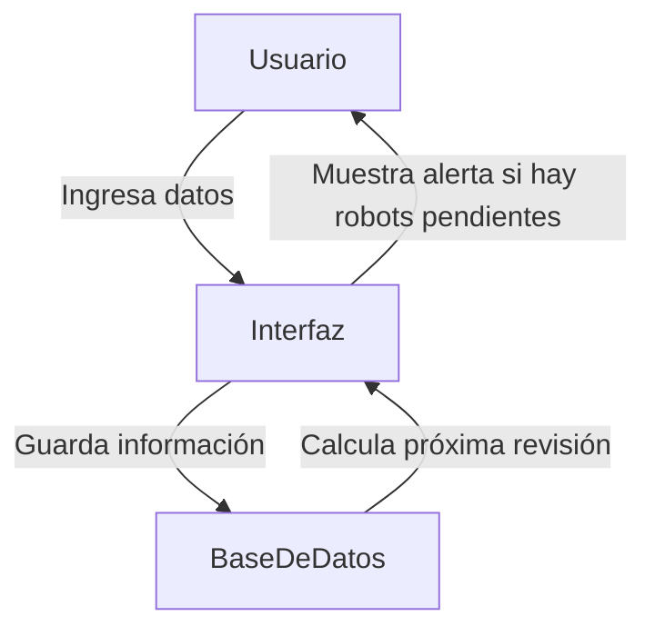

# Sistema de Gestión de Mantenimiento para Brazos Robóticos

## Descripción del Proyecto

Este proyecto consiste en el desarrollo de un **software de gestión de mantenimiento** para brazos robóticos en un entorno industrial. La solución permitirá **registrar, gestionar y notificar** las revisiones de mantenimiento, asegurando que los robots operen de manera eficiente y evitando fallos inesperados. 

### Características principales:
✅ **Registro de robots** con información detallada (modelo, fecha de última revisión, próxima revisión).  
✅ **Cálculo automático** de la fecha de la próxima revisión.  
✅ **Generación de reportes** de robots que necesitan mantenimiento.  
✅ **Alertas visuales** si un robot está fuera de su período de revisión.  

## Ciclo de Vida del Dato

Los datos en este proyecto siguen el siguiente flujo:
1. **Generación:** Se ingresan los datos manualmente desde la interfaz gráfica.
2. **Almacenamiento:** Se guardan en una base de datos **SQLite**.
3. **Consulta y Actualización:** El sistema consulta los datos para mostrar reportes y actualizar fechas de revisión.
4. **Eliminación:** Se pueden eliminar registros de robots que ya no están en uso.

### Estrategia para garantizar la consistencia e integridad:
- Uso de **claves primarias** en la base de datos.
- Restricciones de **formato en las fechas** para evitar errores.
- Validaciones en la interfaz para evitar datos inconsistentes.

## Almacenamiento en la Nube

Actualmente, el software utiliza **SQLite** como base de datos local. Sin embargo, en futuras versiones se podría integrar:
- **Google Firebase** o **AWS DynamoDB** para almacenamiento en la nube.
- **Encriptación** de datos para seguridad.
- **Backups automáticos** para garantizar disponibilidad.

## Seguridad y Regulación

Aunque la base de datos es local, en futuras versiones se podrían implementar:
- **Cifrado de datos** para proteger información sensible.
- **Autenticación de usuarios** si se amplía a múltiples operarios.
- **Cumplimiento con GDPR**, asegurando que los datos personales de los operarios (si se agregan) se gestionen correctamente.

## Impacto en Negocio y Planta Industrial

- **Negocio:** Mejora la organización y reduce costos de mantenimiento imprevistos.
- **Planta:** Permite **automatizar la gestión del mantenimiento**, reduciendo errores humanos.
- **Otros entornos:** Podría aplicarse a hospitales para gestionar mantenimiento de equipos médicos.

## Integración entre IT y OT

Este software ayuda a conectar IT y OT mediante:
- **Automatización del mantenimiento** en la planta.
- **Digitalización de registros** para evitar hojas de cálculo manuales.
- **Mejora en la toma de decisiones**, ya que los datos quedan disponibles para análisis.

## Tecnologías Utilizadas

- **Lenguaje:** Python con Tkinter para la interfaz gráfica.
- **Base de Datos:** SQLite.
- **Gráficos y Reportes:** Matplotlib (posible implementación futura).
- **Diagrama Mermaid:** Representación visual del flujo del software.

## Diagrama del Sistema

